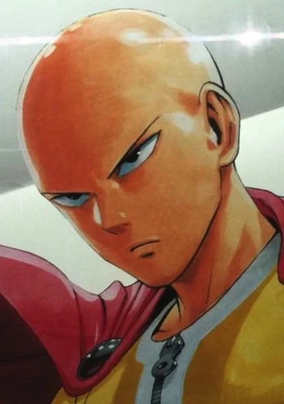
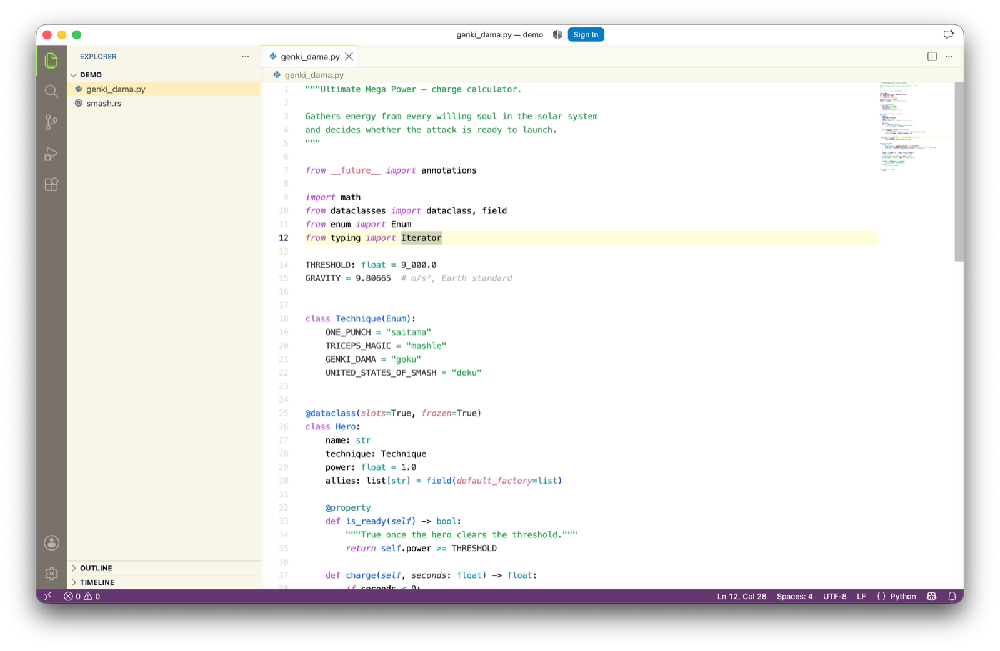
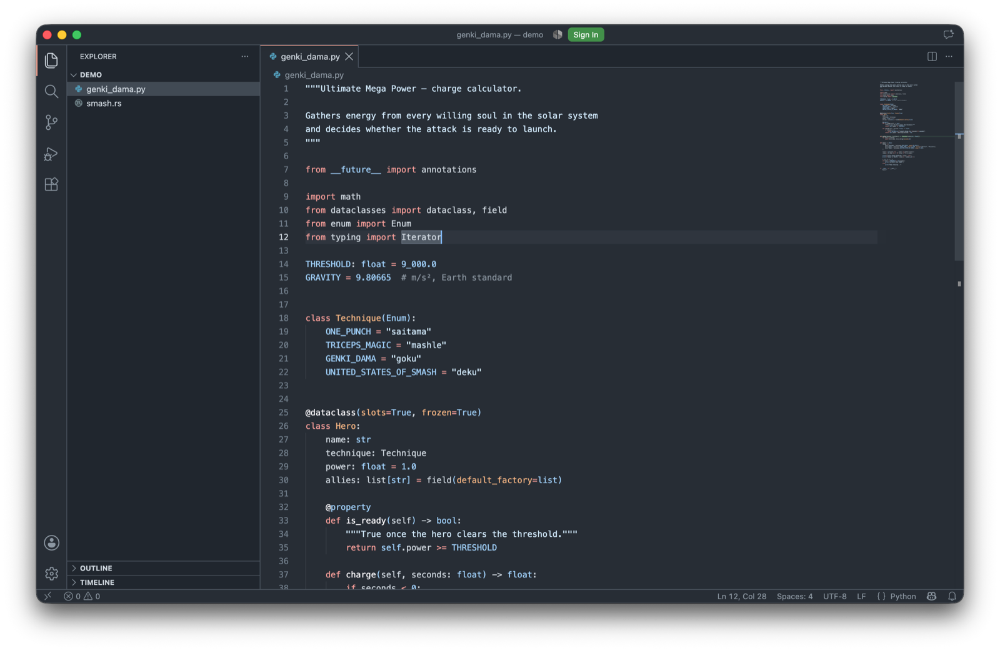

# UMP Theme — Ultimate Mega Power

**English** · [Português](#português)

<!-- Screenshots: drop the two PNGs in assets/ and uncomment the block below.


-->

## English

**Ultimate Mega Power Theme** is the theme of the most powerful geeks and nerds of the planet.

It looks like Saitama's One Punch. Or Mashle's Triceps Magic. Or Goku's Genki Dama. Or even Deku's United States of Smash.

Just do it. 💥

### Two themes, one power level

**Ultimate Mega Power Light** — the original. A bright, high-contrast workspace built for daylight and open blinds: a clean white canvas, a warm cream sidebar, a burning orange cursor you will never lose, and a lime-green selection that hits like a charged attack. Deep purple accents on the status bar keep the whole thing from feeling clinical. Syntax highlighting is tuned per language, with dedicated rules for Python, Rust, Haskell, and Unison.

**Ultimate Mega Power Dark** — the night form. A soft, lifted slate palette that keeps contrast readable without burning your retinas at 2 a.m. Muted blues, greens, and purples over a calm dark canvas, at a 9.45:1 editor contrast ratio.

| | Light | Dark |
| --- | --- | --- |
| Editor background | `#ffffff` | `#272d35` |
| Editor foreground | `#000000` | `#ced6de` |
| Sidebar | `#f7f6e7` | `#20262e` |
| Cursor | `#e67817` | `#81b6f8` |
| Selection | `#dfff00` | — |
| Status bar | `#562164` | `#272d35` |

### Install

From the Extensions view (`Cmd+Shift+X` / `Ctrl+Shift+X`), search for **UMP Theme** and hit Install.

Or from your terminal:

```sh
code --install-extension alexdnegrone.ump-theme
```

### Activate

Press `Cmd+K Cmd+T` (macOS) or `Ctrl+K Ctrl+T` (Windows / Linux), then pick **Ultimate Mega Power Light Theme** or **Ultimate Mega Power Dark Theme**.

### Feedback

Found a color that hurts? Open an issue at [github.com/lexcesar/ump-theme/issues](https://github.com/lexcesar/ump-theme/issues).

---

## Português

[English](#english) · **Português**

O **Ultimate Mega Power Theme** é o tema dos geeks e nerds mais poderosos do planeta.

Ele parece o One Punch do Saitama. Ou a Magia de Tríceps do Mashle. Ou a Genki Dama do Goku. Ou até o United States of Smash do Deku.

Just do it. 💥

### Dois temas, um nível de poder

**Ultimate Mega Power Light** — o original. Um ambiente claro e de alto contraste, feito pra luz do dia e persiana aberta: tela branca limpa, barra lateral em creme quente, um cursor laranja ardente que você nunca mais perde de vista, e uma seleção verde-limão que acerta como um golpe carregado. Os toques de roxo profundo na barra de status impedem que o conjunto fique clínico demais. O realce de sintaxe é ajustado por linguagem, com regras dedicadas pra Python, Rust, Haskell e Unison.

**Ultimate Mega Power Dark** — a forma noturna. Uma paleta ardósia suave e elevada, que mantém o contraste legível sem queimar sua retina às 2 da manhã. Azuis, verdes e roxos dessaturados sobre uma tela escura calma, com razão de contraste de 9.45:1 no editor.

| | Claro | Escuro |
| --- | --- | --- |
| Fundo do editor | `#ffffff` | `#272d35` |
| Texto do editor | `#000000` | `#ced6de` |
| Barra lateral | `#f7f6e7` | `#20262e` |
| Cursor | `#e67817` | `#81b6f8` |
| Seleção | `#dfff00` | — |
| Barra de status | `#562164` | `#272d35` |

### Instalação

Na aba de extensões (`Cmd+Shift+X` / `Ctrl+Shift+X`), busque por **UMP Theme** e clique em Install.

Ou pelo terminal:

```sh
code --install-extension alexdnegrone.ump-theme
```

### Ativação

Aperte `Cmd+K Cmd+T` (macOS) ou `Ctrl+K Ctrl+T` (Windows / Linux) e escolha **Ultimate Mega Power Light Theme** ou **Ultimate Mega Power Dark Theme**.

### Feedback

Achou uma cor que incomoda? Abra uma issue em [github.com/lexcesar/ump-theme/issues](https://github.com/lexcesar/ump-theme/issues).

---

## License · Licença

[MIT](LICENSE) © Alexander Costa
